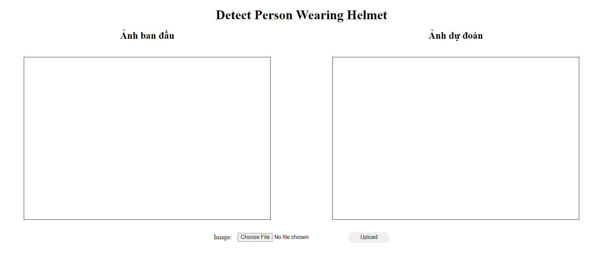
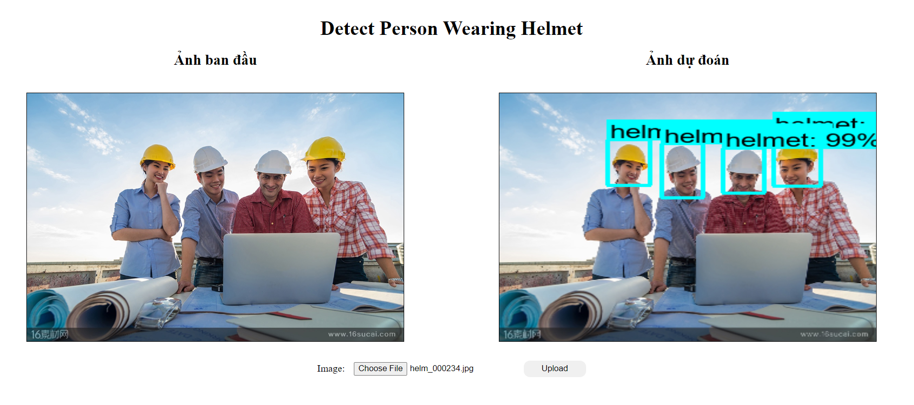

# Model Detect Person Wearing Safety Helmet
Our project, “Model Detect Person Wearing Safety Helmet,” utilizes machine learning and computer vision technology to detect individuals wearing safety helmets. The primary goal of this project is to enhance safety in work environments such as construction sites, manufacturing plants, and other industrial areas.

Our model is trained using the TensorFlow Object Detection API, a powerful framework that allows for object detection in images. We have used a large dataset containing images of individuals wearing safety helmets in various environments and angles to ensure the model can operate effectively in real-world scenarios.

This model not only detects individuals in images but also determines whether they are wearing a safety helmet. This allows organizations to quickly identify and address potentially dangerous situations, ensuring compliance with occupational safety regulations.

We have also developed a web page using Django, allowing users to upload images and process them with our model. The end result is a comprehensive system, from the server-side to the user interface, that effectively monitors and ensures occupational safety.
# Install and Set up all dependencies
#### Create and activate environment variables
```
python -m venv myvenv
.\myvenv\Scripts\activate
```
#### Install jupyter notebook, ipykernel, add environment to jupyter notebook and open jupyter notebook in terminal
```
pip install jupyter ipykernel
python -m ipykernel install --user --name=myvenv
jupyter notebook
```
#### Open Setup.ipynb and click change kernel

#### Change kernel to myvenv and run all cells

# Model
You can also work with model in both vscode terminal and jupyter notebook
## Train model
You can train from the VSCode terminal or train within the Jupyter notebook
### In vscode terminal
#### Train from pretrain model
```
python .\scripts_py\train_model_detect.py
```
#### Train from checkpoint model
```
python .\scripts_py\train_model_detect_from_checkpoint.py
```
You can change all config you want in both train_model_detect.py and train_model_detect_from_checkpoint.py
### In jupyter notebook
Run scripts_ipynb\CustomAndTrainModel.ipynb
## Evaluate model
#### In vscode terminal
```
python scripts_py\evaluate_model_detect.py
```
#### In jupyter notebook
Run scripts_ipynb\EvaluateModel.ipynb
## Save model
#### In vscode terminal
```
python scripts_py\save_model.py
```
#### In jupyter notebook
Run scripts_ipynb\SaveModel.ipynb
## Detect Image
You can open website and upload image to detect
#### Change directory to website project directory
```
cd WebSiteDeploy\helmet_detection\helmet_detection
```
#### Run server
```
python manage.py runserver
```
The server will run on http://127.0.0.1:8000 with port 8000 which is the default port

#### If you want to run on a specific port, run the following command
```
python manage.py runserver 7000
```
The server will run on http://127.0.0.1:7000

You can also connect to server from internet if using the same wifi, using Wireless LAN IPV4 address which server is running on.

You can get Wireless LAN IPV4 address in command prompt using the following command
```
ipconfig
```
Example: if your IPV4 address is 192.168.1.50, your URL to server is 192.168.1.50:7000, with 7000 is the port server is running on, you can type this in the web browser and get to the server page

### The server main page

Click the choose file to browse your image and then upload it, when upload wait for seconds and see the results
### Detect result
